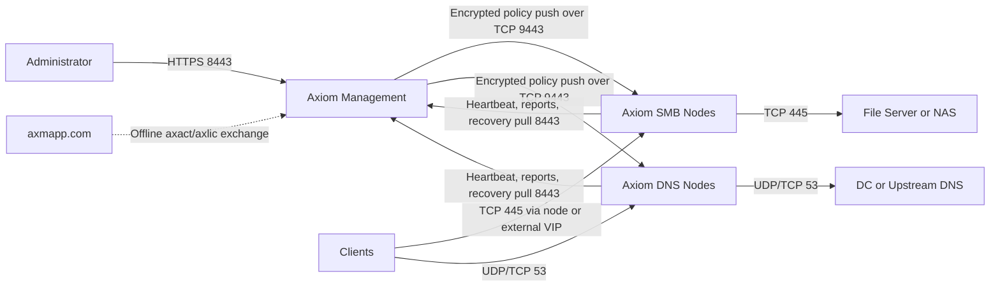

# Axiom Developer Handoff

Last verified: 2026-08-09

This is the system-level onboarding document for engineers working on Axiom.
It covers both repositories, the deployed product, the company website and
customer portal, cross-repository contracts, release procedures, security
invariants, current limitations, and the safest places to begin a change.

Do not put credentials, signing keys, enrollment tokens, customer data, or
generated `.axact`/`.axlic` files in this document or anywhere in Git.

## Repositories and Ownership

| Repository | URL | Owns |
| --- | --- | --- |
| Axiom product | `https://github.com/taltol15/Axiom` | Rust daemon, Management UI/API, SMB and DNS nodes, control protocol, policies, reputation, licensing format, Linux installer and product operations docs |
| Axiom website | `https://github.com/taltol15/axiom-website` | Public website, authenticated docs, customer portal, staff backoffice, PostgreSQL schema, email delivery, customer license issuance and Railway deployment |

The repositories are deliberately separate. The website never becomes the
runtime control plane for customer nodes. The Management Server in the product
repository owns customer node enrollment, configuration, policy, telemetry and
audit. The website owns company/customer operations and offline license
issuance.

### Source-of-Truth Rules

- Product behavior, config schema and network protocols: `Axiom`.
- License payload, signature verification and `axiom-license-tool`: `Axiom`.
- Marketing copy, customer/staff accounts and issued-license records:
  `axiom-website`.
- Customer deployment documentation exists in both places. Product docs are
  Markdown under `docs/`; website docs are canonical PostgreSQL rows installed
  through append-only Drizzle migrations.
- The website vendors only the minimal `axiom-license` workspace under
  `vendor/Axiom`. It is a copy, not a second implementation.

## Product Mental Model

Axiom is installed as separate Linux roles. Production best practice is at
least one Management Server, one or more SMB Proxy Nodes, and one or more DNS
Nodes.



### Roles

| `node.role` | Starts | Intended use |
| --- | --- | --- |
| `management` | Axum Management UI/API | Central management only |
| `smb_proxy` | SMB proxy, node control listener and node agent | SMB data plane |
| `dns` | DNS gateway, block-page listener, node control listener and node agent | DNS data plane |
| `standalone_lab` | Management plus configured SMB/DNS services | Lab and compatibility use only |

Role decisions are implemented in `crates/axiom-config/src/lib.rs` and task
startup is in `crates/axiom-daemon/src/main.rs`.

## Rust Workspace

| Crate | Responsibility |
| --- | --- |
| `axiom-config` | TOML schema, defaults, validation, role/cluster/service-template types |
| `axiom-control` | Authenticated ChaCha20-Poly1305 policy envelopes and push acknowledgements |
| `axiom-core` | Shared runtime state, counters, events, SMB parsing, inspection policy and telemetry snapshots |
| `axiom-daemon` | Process entry point, role task orchestration, node agent, reporting and asynchronous reputation workflow |
| `axiom-dns` | UDP/TCP DNS proxy, local A/AAAA records, cache, domain policy, feeds and HTTP block page |
| `axiom-license` | Offline trial, machine fingerprint, Ed25519 verification, activation/license formats and issuer CLI |
| `axiom-net` | NIC-bound listeners/connectors, SMB framing, bidirectional relay, streaming hashes and inline enforcement |
| `axiom-reputation` | Durable reputation JSON store, audit log, lookup/update/import and scanner-provider abstraction |
| `axiom-web` | Embedded Management dashboard, browser auth, APIs, diagnostics, backup/restore, fleet and cluster management |

The workspace uses Rust edition 2024 and MSRV 1.88. `Tokio` is the async
runtime, `Axum` is the web framework, `socket2` supplies Linux socket options,
and `rustls` is the TLS stack.

## Configuration and Runtime Files

The installed config is `/etc/axiom/axiom.toml`. The complete typed schema is
in `axiom-config`; examples are `config/axiom.toml` and
`config/axiom.example.toml`.

Top-level config sections:

- `[node]`: role, node identity, Management URL, enrollment credential,
  heartbeat, cluster membership and control listener.
- `[clusters]`: Management-owned cluster groups, password hashes, members and
  shared service templates.
- `[management]`: Management NIC/IP/port, local admin, TLS and LDAP settings.
- `[dns]` and `[dns.policy]`: listener/upstreams/cache, domain policy, local
  records and block-page customization.
- `[policy.*]`: SMB, archive, entropy, signature and reputation policy.
- `[license]`: verification key, license/trial paths and warning threshold.
- `[[proxy_listeners]]`: SMB source interface/listener and backend file server.

Important installed paths:

| Path | Data |
| --- | --- |
| `/usr/local/bin/axiom-daemon` | Installed daemon |
| `/etc/axiom/axiom.toml` | Primary durable product configuration |
| `/etc/axiom/tls/axiom.crt` / `axiom.key` | Management TLS material |
| `/etc/axiom/license.json` | Installed signed license |
| `/var/lib/axiom/license-state.json` | Trial anti-rollback state |
| `/var/lib/axiom/reputation.json` | Management reputation entries and scan queue |
| `/var/log/axiom/audit.jsonl` | Product audit stream |
| `/var/log/axiom/reputation-audit.jsonl` | Permanent reputation mutation audit |
| `/etc/systemd/system/axiom.service` | Service unit generated by installer |

Fleet reports, active connections, recent UI events and DNS cache are currently
in memory. They rebuild from node reports and live traffic after a restart.

## Control-Plane Flow

1. Management installation creates the browser admin and enrollment token.
2. A DNS/SMB node is installed with the Management URL and token, or joins a
   cluster using its cluster name/password.
3. The node receives a unique credential and starts its control listener on
   TCP 9443.
4. The node agent periodically pulls runtime policy, posts a node report and
   reports SMB file reputation metadata to Management on TCP 8443.
5. Saving policy in Management actively pushes a `ControlPolicyBundle` to each
   eligible node and records its acknowledgement/generation.
6. Missed pushes recover through the periodic pull path.

The TCP 9443 API currently uses HTTP transport with an authenticated encrypted
ChaCha20-Poly1305 payload derived from the per-node secret. Production networks
must still restrict TCP 9443 to Management addresses. Node-to-Management traffic
should use trusted HTTPS. There is no mTLS implementation today.

### Management API Groups

- Status, diagnostics, smoke tests and backup/restore.
- Node report and runtime-config recovery.
- Cluster create/join/update/sync/member revocation.
- Management TLS configuration.
- License status/install.
- Reputation CRUD/import/lookup/file reports.
- Enrollment-token display/rotation.
- SMB and DNS policy get/update/self-test.
- Browser login/logout.

Routes are declared together near the top of `crates/axiom-web/src/lib.rs`.
Browser operations use the Management session cookie; node operations use the
node enrollment credential. Preserve this boundary when adding endpoints.

## Cluster and High Availability

An Axiom cluster is a Management-controlled policy/configuration group, not a
traffic-balancing or consensus system.

- A Source Node supplies the shared service-template baseline.
- Replicas receive the template and current policy during enrollment.
- Local NIC names, local listen IPs, control IPs and egress interfaces are never
  copied because they are machine-specific.
- `Sync now` refreshes the baseline from the reporting Source Node and pushes
  current policy; SMB sync also pushes known-bad hashes.
- Existing nodes keep serving their locally installed policy if Management or
  the Source Node is unavailable.
- Cluster join passwords are Argon2 hashes. Successful replicas receive unique
  credentials. Rotating the join password affects future joins only.

Traffic HA remains external:

- SMB: Layer 4 raw TCP/445 LB/VIP with connection persistence, long idle
  timeout, health checks and draining. `PROXY protocol` must be disabled.
- DNS: publish multiple DNS node addresses via DHCP, endpoint config or DC
  forwarders.

Read `docs/CLUSTER_AND_HIGH_AVAILABILITY_KB.md` before changing cluster
behavior or making HA claims.

## SMB Data Plane

### Connection Path

1. The client connects to an Axiom listener on TCP 445.
2. `SO_BINDTODEVICE` pins the listener to the configured client interface.
3. Axiom connects to the configured file server through that interface.
4. The relay frames NetBIOS Session Service/SMB messages and inspects both
   directions before forwarding.
5. Counters record socket traffic, forwarded traffic, SMB writes, files,
   connections, policy events and per-route state.

The installer disables Linux IPv4 forwarding for SMB roles and warns about NAT
rules referencing TCP 445. Production firewalls must deny clients direct TCP
445 access to the backend and allow it only from Axiom SMB nodes.

### Streaming Inspection and Reputation

- SMB CREATE/WRITE/CLOSE state maps file IDs to names and streamed content.
- SHA256 and MD5 are updated incrementally without buffering a full file.
- Completed metadata includes name, extension, MIME guess, size, timestamps,
  source IP, optional source user and destination context.
- The Management known-bad SHA256 feed is held locally for low-latency matching.
- Small inline lookups may query Management with a three-second timeout and a
  short cache. Lookup failure is fail-open and logged.
- Completed transfers are reported asynchronously to Management; SMB traffic
  does not wait for that report.
- `Alert` logs a known-bad verdict. `Block` denies the SMB frame, sends an SMB
  access-denied response where possible and terminates the stream.
- `Quarantine` currently has deny/block semantics. It does not save a
  quarantined copy of the file.

SMB encryption hides file payloads from content, archive, signature and hash
inspection. The encrypted-payload policy can monitor or block that condition.
SMB multichannel interface discovery is blocked to prevent alternate paths
around the proxy. Server-side copy operations are detected, but their data may
remain entirely on the file server and therefore cannot be content-scanned as a
normal client upload.

This is a protocol-aware streaming security proxy, not a complete antivirus
engine. Signature rules are byte patterns; archive rules do not recursively
extract encrypted archives; no ClamAV, YARA, VirusTotal, MISP or sandbox provider
is integrated yet.

## DNS Data Plane

Axiom listens on UDP and TCP 53 on the selected interface, evaluates domain
policy, returns local records or block responses, caches safe responses, and
forwards allowed packets through the configured upstream interface.

Current capabilities:

- Domain allow/monitor/block lists and parent-domain matching.
- Optional administrator-configured hosts-style threat feeds.
- In-memory bounded cache with TTL capping.
- Multiple upstreams with rotation/failover and loop prevention.
- Local `A` and `AAAA` records.
- `NXDOMAIN`, `REFUSED` and sinkhole/block-page responses.
- UDP and TCP client/upstream paths with telemetry.

The branded block page is a small local HTTP server on TCP 80. It supports an
embedded custom PNG/JPEG/WebP logo, UTF-8/Hebrew text, color and support link.
Automatic cluster mode returns each DNS node's own address. An explicit
sinkhole IP targets an external page/VIP. HTTPS sites normally show a
certificate error before HTTP content because Axiom does not impersonate the
blocked domain.

Current DNS boundaries:

- This is a forwarding security resolver, not a general authoritative DNS
  server or Active Directory DNS replacement.
- Local record management is A/AAAA only.
- DNS category controls are UI scaffolding; no category intelligence provider
  is connected and category policy is inactive.
- There is no built-in DoH/DoT endpoint or DNSSEC validation engine.
- Cache and recent-query history are in memory.

See `docs/DNS_BLOCK_PAGE_KB.md` for exact network and browser behavior.

## Reputation Subsystem

Management stores reputation entries in `/var/lib/axiom/reputation.json` and
permanent change audit records in `/var/log/axiom/reputation-audit.jsonl`.

Verdicts are `known_good`, `known_bad` and `unknown`. Entries track SHA256,
optional MD5, source, notes, timestamps, hit count and last seen. CRUD, lookup,
bulk import and file report APIs are in `axiom-web`.

Unknown file reports create scan queue items. `ScannerProvider` is the extension
contract, but the only provider today is `NoopScannerProvider`; it does not run
an antivirus scan. Integrate future scanners behind this abstraction instead of
hardcoding a vendor into the SMB relay.

## Offline Licensing and Website Integration

The product uses Ed25519-signed licenses:

1. Management evaluates local usage and exports an `.axact` activation request.
2. Staff uploads it to `axmapp.com/admin/licenses`.
3. The website invokes the Rust `axiom-license-tool` server-side with the
   private signing key available only as a Railway secret or protected file.
4. The website stores the issued license/audit row and makes the `.axlic`
   available to the assigned customer portal.
5. The customer uploads `.axlic` in Management. Axiom verifies it locally with
   the bundled/configured public key; no internet access is required.

License limits cover SMB nodes, DNS nodes, protected clients and reputation
entries. Licenses may be machine-bound and optionally restrict node IDs.

Critical cross-repo rule: if `crates/axiom-license`, its dependencies, license
format or public verification key changes, refresh the minimal copy at
`axiom-website/vendor/Axiom`, rebuild the website Docker image, and run a real
`.axact -> .axlic -> Management install` compatibility test. Never put the
private key in the product repository, website repository, image or customer
server.

## Installer and Linux Service

Customer artifact: `axiom-installer.sh`. It is generated by
`scripts/build-installer.sh` and embeds the full source tree. Never hand-edit the
generated installer; edit `install.sh` or source files and regenerate it.

The interactive installer:

- Checks/installs dependencies on Ubuntu/Debian.
- Uses `whiptail` when available and CLI prompts otherwise.
- Discovers NICs and role-specific addresses.
- Supports Management, SMB, DNS, standalone lab and cluster replica enrollment.
- Generates `/etc/axiom/axiom.toml`.
- Builds release binaries using the system BFD linker.
- Installs capabilities `CAP_NET_BIND_SERVICE` and `CAP_NET_RAW`.
- Creates the `axiom` user, hardened systemd unit and optional restart helper.
- Enables and starts `axiom.service`.

Operational modes:

```bash
sudo ./install.sh --repair
sudo ./install.sh --uninstall
sudo ./install.sh --uninstall --purge
```

Repair preserves customer config. Purge removes config, state and logs. Set
`AXIOM_INSTALLER_CLI=1` to force plain prompts. The license issuer tool is not a
customer component; `AXIOM_INSTALL_LICENSE_TOOL=1` is for controlled company
issuance environments only.

## Website and Customer Operations Portal

The second repository is a Next.js 16/React 19 application deployed on Railway
with PostgreSQL and Drizzle.

Main surfaces:

| Route | Purpose |
| --- | --- |
| `/` | Public marketing/product overview |
| `/docs` | Authenticated customer/staff documentation; `noindex` |
| `/status` | Company website/portal/licensing/support status, not customer node monitoring |
| `/contact` | Inquiry form stored in staff backoffice |
| `/portal` | Customer login, licenses, downloads, tickets, team and security settings |
| `/admin` | Staff customer/license/docs/support/status backoffice |

PostgreSQL stores organizations, customer/staff users and sessions, licenses,
issued licenses, tickets/messages, docs, contacts, status, account tokens,
login attempts and the email outbox. Schema source is
`axiom-website/src/db/schema.ts`.

Authentication uses separate customer and staff cookies, bcrypt password
hashes, database sessions, TOTP 2FA with encrypted secrets, single-use recovery
codes, rate limiting, email verification and password reset tokens. Keep
`AUTH_ENCRYPTION_KEY` stable; rotating it invalidates encrypted TOTP material.

Resend is used for verification/recovery email. Without `RESEND_API_KEY`, email
stays visible in Admin Email Outbox for controlled manual delivery. Production
start runs Drizzle migrations before Next.js starts.

The Railway Dockerfile builds the vendored Rust license tool in one stage and
the Next.js app in another. Production is the Railway project/service
`axiom-website` at `https://axmapp.com`.

## Cross-Repository Change Matrix

| Change | Product repo | Website repo |
| --- | --- | --- |
| New/renamed product capability | Implement, config, tests, installer, product docs | Update marketing, authenticated docs and support copy |
| License format/key/dependency | Change `axiom-license`, verifier and tests | Refresh `vendor/Axiom`; rebuild issuer; test end to end |
| License limit/edition | Update payload/evaluation/UI | Update issuer form, validation, DB/audit display and portal |
| Node/cluster field | Config/control/report/UI/installer/docs | Update architecture/install docs where customer-facing |
| Network port or flow | Service and installer | Network matrix, docs and marketing/security claims |
| New diagnostic/support workflow | Management Support UI/runbooks | Customer docs and staff support procedure |
| Website-only account/billing/support | No product change unless contract changes | Schema migration, routes, email and portal/admin UI |

Never copy product runtime state into the website database or make customer
nodes depend on `axmapp.com` for normal operation. Air-gapped deployments must
continue operating and licensing must remain offline-capable.

## Security Invariants

- Never log or commit passwords, enrollment secrets, cluster join passwords,
  TOTP secrets, recovery codes, private signing keys or customer license files.
- Only the public Ed25519 verification key belongs on customer servers.
- Restrict node TCP 9443 to Management and use trusted HTTPS for TCP 8443.
- Management NIC must not be the SMB/DNS client-facing NIC in production.
- Deny direct client SMB to the backend to prevent inspection bypass.
- Do not enable Linux forwarding/NAT as a substitute for the user-space proxy.
- Do not enable LB `PROXY protocol` on SMB.
- Preserve fail-open behavior for external reputation outages unless a future
  explicit policy and customer-visible failure mode are designed.
- Apply HTML escaping/CSP rules to DNS block-page customization.
- Treat config, audit, diagnostics and support bundles as sensitive data.
- Website migrations are append-only after deployment. Never modify an applied
  migration expecting Railway to rerun it.

## Build, Test and Release

Product checks:

```bash
cargo fmt --all -- --check
cargo test --workspace
cargo build --release -p axiom-daemon
bash -n install.sh
./scripts/build-installer.sh
bash -n axiom-installer.sh
./scripts/build-lab-installer.sh
bash -n axiom-lab-installer.sh
```

Run focused tests for changed crates during development, then the complete
release checklist. The baseline has historical strict-Clippy warnings outside
recently changed crates; do not hide new warnings behind that fact.

Website checks:

```bash
npm ci
npm run lint
npm run build
npm audit --omit=dev
npx drizzle-kit check
docker build -t axiom-website:local .
```

As last verified, the website production dependency audit still reports high
severity advisories affecting `next`, transitive `sharp`, and `nanoid`.
Upgrading and revalidating those dependencies is a website production-release
gate; a successful Next.js build alone does not close the security review.

For a product release:

1. Review `docs/RELEASE_CHECKLIST.md`.
2. Run `docs/VALIDATION_TEST_PLAN.md` in the three-server lab plus replicas.
3. Regenerate both installers after any source/install change.
4. Verify fresh install and `--repair` for all roles.
5. Capture Support smoke tests, diagnostics, backup and UI evidence.
6. Verify `.axact/.axlic` compatibility against the deployed website issuer.
7. Update website docs/claims in the separate repository.
8. Commit and push each repository independently.
9. Confirm Railway migration/build/health after website push.

## Fast Troubleshooting

Product:

```bash
sudo systemctl status axiom --no-pager
sudo journalctl -u axiom -n 200 -l --no-pager
sudo ss -lntup | egrep ':8443|:9443|:445|:53|:80'
sudo grep -nE 'role|management_url|enrollment_token|cluster|control' /etc/axiom/axiom.toml
```

Website:

```bash
npm run lint
npm run build
npx drizzle-kit check
railway status
railway deployment list --limit 5
railway logs --lines 200
curl -fsS https://axmapp.com/api/health
```

## Documentation Index

- `README.md`: setup and feature summary.
- `docs/PRODUCT_OVERVIEW.md`: role and product overview.
- `docs/PRODUCTION_DEPLOYMENT.md`: topology and deployment.
- `docs/CUSTOMER_INSTALLATION_GUIDE.md`: role-by-role installation.
- `docs/OPERATIONS_RUNBOOK.md`: support operations.
- `docs/CLUSTER_AND_HIGH_AVAILABILITY_KB.md`: Cluster/LB/DNS HA contract.
- `docs/DNS_BLOCK_PAGE_KB.md`: block-page behavior and limitations.
- `docs/RELEASE_CHECKLIST.md`: ship gate.
- `docs/VALIDATION_TEST_PLAN.md`: lab evidence plan.
- `axiom-website/DEVELOPER_HANDOFF.md`: equivalent system-level handoff from
  the website repository's perspective.

## First-Day Checklist for the Next Engineer

1. Read this file, both READMEs, the release checklist and validation plan.
2. Confirm both Git remotes before pushing anything.
3. Build/test both repositories without changing code.
4. Inspect a lab Management, SMB and DNS config; never use production secrets.
5. Walk through node heartbeat/push, SMB transfer/hash, DNS query/block and
   offline license issuance.
6. Review current Railway variables by name only; never export secret values
   into logs or local files.
7. Make the first change in one ownership boundary, add tests and update the
   cross-repository documentation if the customer contract changed.
